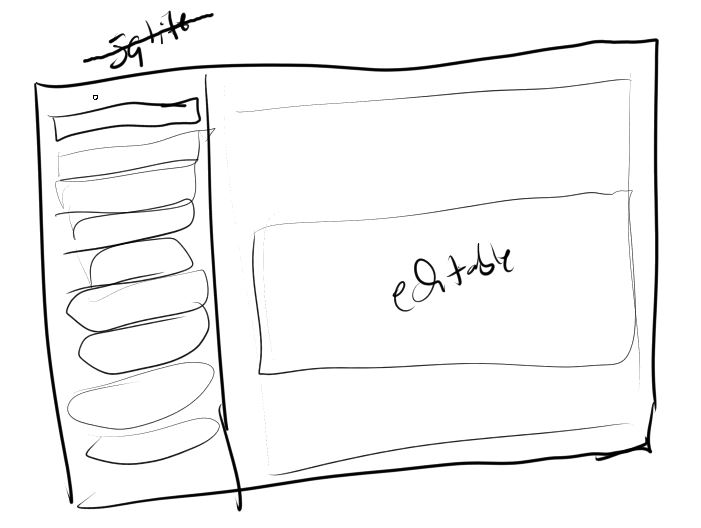
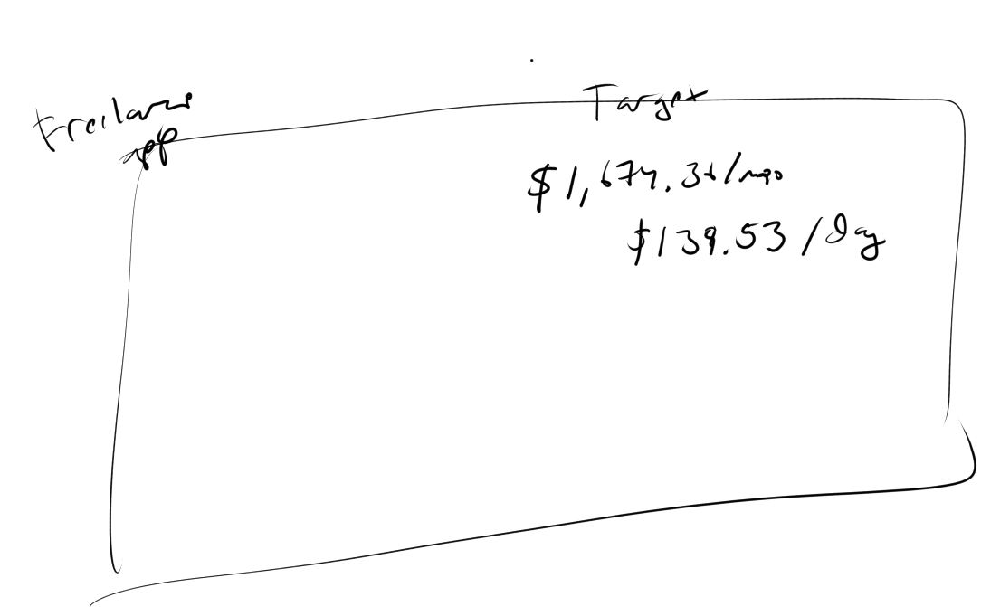

01/16/2024

2:56 PM

Still have not landed a gig but working for a client I worked with in the past at least

I've been able to get by by moving my balances around eg. pay this card, pull that money out and pay the other card... it's bad

I was thinking about putting a 1TB SSD on a raspberry pi at some point, I have a few running as servers at home but they're on the SD card/those can fail. Granted I buy the more expensive sandisk gold

3:09 PM

Distracted

3:18 PM

This concept is for a general note taking app (another project)

But same idea, sidebar, look up... little icons on left of sidebar tab like deadline

The right side, it will be scrollable with content editable sections (supports photo embed)

3:23 PM

I feel fortunate to know the skills that I know

I can just build stuff/will them into existence it's great

---

01/02/2024

2:11 PM

So I'm short by like `$1.5K`/mo or about `$370`/wk

right now I work 4x10s (labor) so I spend my worknights applying to jobs and applying to freelance

I have not landed a job... my last UpWork gig was from 2018

Since then I had been working in some form of tech job W2 eg. front end or software engineer of varying level

UpWork has changed since then... it's like a job takes 8 or 16 connects to apply to and each connect is $0.15 so yeah... just applying costs you money

Anyway this app would give me motivation seeing that number, $370 is not a lot... but it is if you can't land a gig

Also I'll finally take on the drag-drop base64 image to database task via contenteditable html... it's not hard, just have to do it

This is the Medium interface that's nice
