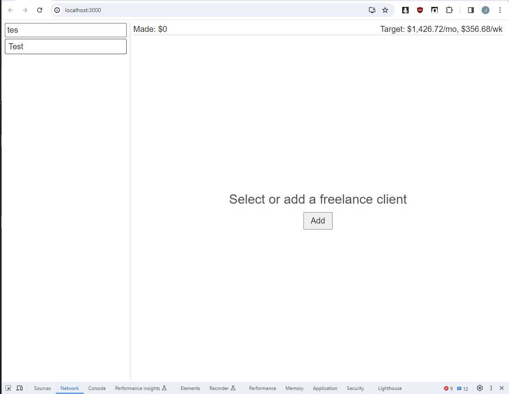
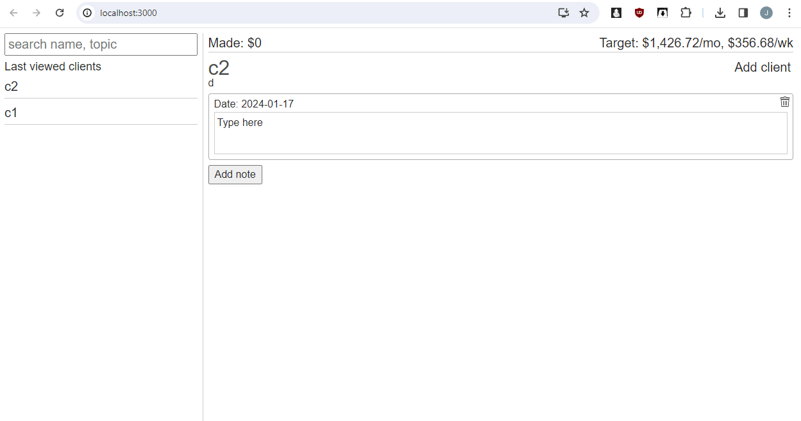

### About

Tracking freelance jobs and gamifying intent to make money

### Tech

Uses ReactJS for the front end with ElectronJS wrapper for deskto app.

API is NodeJS/ExpressJS with mysql2

### Getting started/development in the web

* clone the repo
* open two terminals
  * t1) `node-api` folder
    * npm install
    * fill out `.env` assumes you have a local MySQL db setup
    * run `seed.js`
    * run `nodemon index.js`
  * t2) `react-app` folder
    * npm install
    * npm start

The app should be functional

### Desktop build/dev

* build the react app by running `npm run build`
* in the root folder run `npm start` or look at the package commands in `package.json` based on your OS

### Problems

The caret is problematic on the `contentEditable` specifically when the state updates/repaints the content, the caret position goes to the beginning most times. I think a different approach is to use no coupled-state-rendering where data is still maintained on change but not painted by state.

The main issue is the range stuff and dom targets (nesting divs).

### Misc

Icons from uxwing

### Generating electron icon for Mac

This was a PITA for some reason but iconutil is built into mac (doing this on Monterey)

See [here](https://stackoverflow.com/questions/29293840/how-to-use-iconutil-on-mac-to-generate-icns-file) for more info
